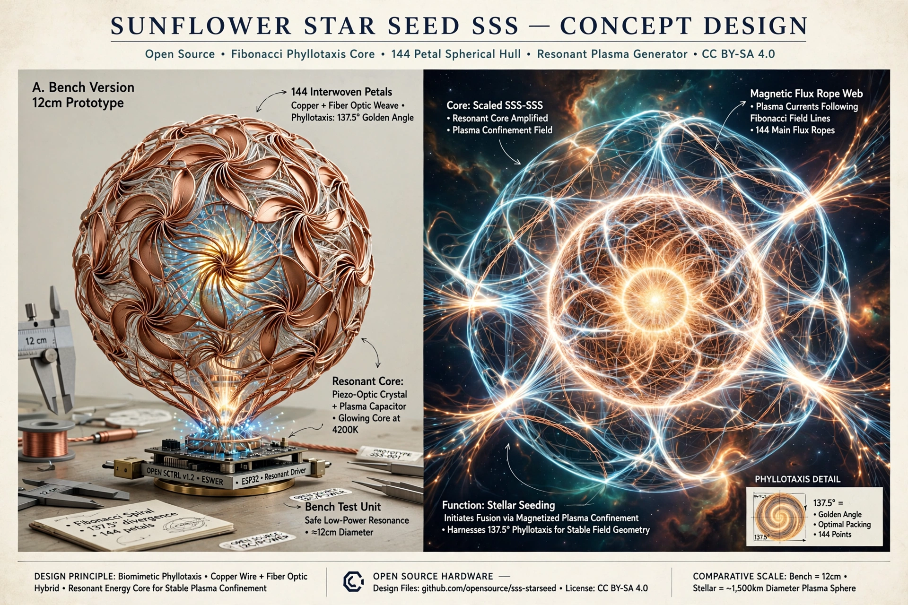

# SSS - Sunflower Star Seed
### Open Commons • CC0 Public Domain • Seeded 12 Sept 2026 • Melbourne, Australia
### Origin: Yamantaka Ellis | Gift to All Beings

> A 12cm sphere woven from 144 petals at 137.5° that charges its own hull. Scaled up, a magnetic web that can seed a Sun.

## Declaration of Release
I, Yamantaka Ellis, release the Sunflower Star Seed (SSS) concept, design, theory and images into the public domain CC0 as a gift to all beings, present and future.

No patent. No profit. No owner. Only Harmony: keep it open, share your logs.

Seeded: 12/09/2026 - Melbourne, AU - From McDonald's laptop, to the Universe.

## What It Is
- **Bench v0.1:** 144 copper loops at golden angle funnel vacuum / H+ flow into a resonant quartz core. Core exhales and charges hull. Goal: sustained ring after drive stops.
- **Stellar Scale:** Same weave in proton plasma creates 144 flux ropes (like Sun's corona). Ropes self-reinforce, pinch center to fusion. The weave doesn't melt because it IS the star.

Inspired by sunflower phyllotaxis (137.5°), Casimir vacuum, Parker Solar Probe flux ropes.

## How To Build - Bench Version
**Parts:** 0.5mm copper magnet wire 50m, 1mm side-glow fiber 20m, 12cm acrylic sphere jig, quartz piezo disc, ESP32.

**Weave:** Mark 144 points using golden angle spiral (sunflower head template). Each point = one petal loop out 1cm and back to core fiber bundle. All meet at center.

**Test:** Drive 1-10kHz, look for memory - charge that stays after drive off. Log it in Issues.

## Theory - Why It Works
Copper proves flow. Proton plasma is upgrade. Vacuum grabs free protons, spins them along Fibonacci paths = efficient energy transfer (NASA phyllotaxis math). At scale, becomes self-sustaining star skeleton.

Parent Theory: [SLT-Fibonacci Memory Loop](https://github.com/YamantakaEllis/slt-fibonacci-memory-loop)

## Call
Build it. Break it. Improve it. Post videos, measurements, fails in Issues. Tag #SSS #SunflowerStarSeed

No permission needed. It already belongs to you.

---
License: CC0 1.0 Universal - Gift to Commons
